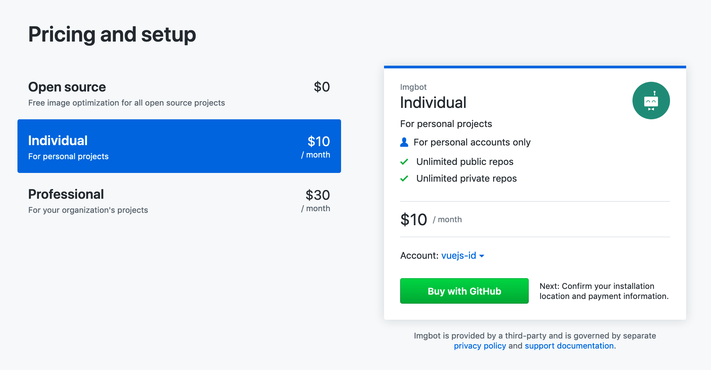
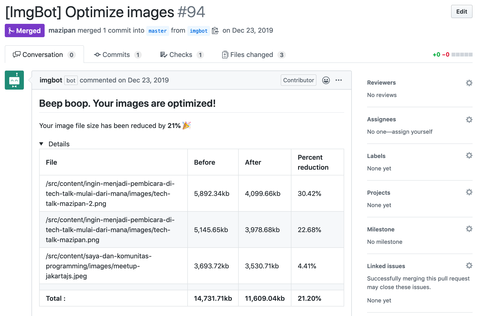

Seperti kita sama-sama ketahui bahwa selain dari kode yang kita tulis baik HTML, CSS dan JavaScript, sebuah web juga diperkaya dengan berbagai media untuk mendukung penyampaian informasi lebih mudah salah satunya adalah media gambar. Gambar merupakan bagian penting dari sebuah website bahkan tidak sedikit website yang memuat banyak sekali gambar seperti beberapa pasar online (marketplace) yang kita ketahui saat ini. Saking banyaknya memang gambar yang digunakan, pada akhirnya bukan lagi kode yang ditulis si pemrogram yang menjadi beban terbesar bagi web tersebut, melainkan gambar yang dimuatnya.

Melihat dari [Web Alamanac 2019 pada bagian media](https://almanac.httparchive.org/en/2019/media), kita juga mengetahui bahwa memang ini menjadi kasus umum yang tidak hanya dijumpai oleh satu dua orang. Data yang dikumpulkan oleh tim yang membuat web almanac diatas menyebutkan paling tidak 44% bagian dari sebuah web berasal dari berbagai media meskipun sudah disetel dengan percentil 10 bila dibandingkan dengan tipe sumber daya selain media.

Mengetahui hal diatas, menjadi kritis bahwa kita sebagai pemrogram yang mengetahui kenyataan ini diharuskan melakukan usaha sebisa kita untuk memperkecil dan mengoptimalkan ukuran media yang akan kita kirimkan ke pengguna website kita. Memang sumber dari gambar bisa bermacam-macam, ada yang statis dan bisa kita kelola ada juga yang dinamis yang tidak berasal dari sisi kita melainkan dari pengguna langsung atau bahkan dari sisi peladen (server) kita.

Cara untuk melakukan optimasi pada gambar dinamis tidak akan kita bahas secara khusus disini dan akan fokus pada gambar statis dan gambar yang ada di basis kode kita. Hal ini menjadi mudah sebenarnya karena gambarnya ada di tangan kita, kita bisa menentuka mau diapakan dan kapan mau diprosesnya. Cara yang bisa kita lakukan pun ada berbagai macam, dan bisa jadi satu dengan yang lain berbeda. Beberapa diantaranya yang saya ketahui adalah:

1. Memasang proses optimasi pada saat `build` oleh webpack atau semacamnya. Ini biasanya dibantu dengan alat semacam [image-webpack-loader](https://www.npmjs.com/package/image-webpack-loader) atau alat lainnya yang bisa membantu secara otomatis mengoptimalkan gambar pada saat proses `build`. Teknik bisa jadi bagus dan terotomasi namun akan meningkatkan waktu yang dibutuhkan untuk menyelesaikan `build` tersebut.

2. Manual, ini cara yang justru sering saya kerjakan 😂. Pertama karena gambar yang saya kelola utamanya pada blog ini pada dasarnya tidak berjumlah banyak dan proses ini hanya saya kerjakan pada saat ada gambar baru yang akan saya tambahkan saja. Saya biasanya menggunakan [tinypng](https://tinypng.com/), [tinyjpg](https://tinyjpg.com/) atau [squoosh.app](https://squoosh.app/).

Nah kedua cara ini tidak akan kita bahas secara dalam, kita akan bahas cara lain yang menurut saya masih jarang yang tau kalau bisa juga dengan cara ini.

## Bot Github

Saya meletakkan kode blog saya di Github, dengan itu maka saya bisa memanfaatkan banyaknya aplikasi dan alat gratis yang disediakan oleh Github maupun orang lain di Github untuk mempermudah pekerjaan saya mengelola blog ini.

Pada saat awal membuat blog ini saya memikirkan bahwa saya pasti akan malas melakukan optimasi gambar secara manual terus-terusan, pada akhirnya ada saja satu dua gambar yang terlewat oleh saya untuk dioptimasi sebelum diunggah.

Dari kasus gambar yang terlewat ini, saya mencari tau bagaimana cara melakukan optimasi gambar di Github tapi yang otomatis. Sampai pada akhirnya saya ketemu Bot dengan nama [ImgBot](https://github.com/marketplace/imgbot) ini. Dan kerennya lagi, ini bot bisa kalian pakai dengan gratis untuk projek dengan kode sumber terbuka.

Cara memasangnya pun cukup mudah kalin cukup kunjungi [halaman mereka di marketplace github](https://github.com/marketplace/imgbot), kemudian pasang dan berikan akses pada bot ini pada projek yang kalian inginkan. Kalian bisa memberikan akses ke semua projek terbuka kalian atau spesifik projek saja, terserah kalian.

Setelah memasang dan akses sudah diberikan, maka kalian cukup tinggal duduk sambil ngopi dan Bot ini akan melakukan pembacaan projek kalian secara otomatis. Bila ditemukan ada gambar yang dirasa belum optimal, maka Bot ini akan membuatkan kalian sebuah pull request yang berisi gambar baru yang telah dioptimalkan oleh mereka. Mudah sekali bukan? Kalau ada yang gratis dan mudah, ngapain pilih yang susah? 🐐

Berikut tampilan salah satu pull request yang dibuat secara otomatis oleh ImgBot

Terakhir, bola ada ditangan kalian. Kapanpun kalian mau dan sempat, kalian bisa melakukan merge pull request tersebut ke projek kalian.

---

Semoga bermanfaat!
