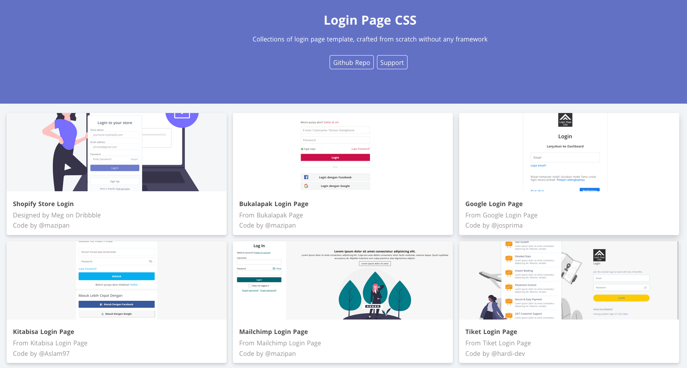

Salah satu HTML atau CSS template paling umum ditemukan adalah login page, hal ini mungkin karena ini juga kebutuhan umum yang hampir selalu dibutuhkan oleh semua aplikasi.

Berangkat dari banyaknya kebutuhan maka jadilah banyak pula orang atau instansi yang menyediakan berbagai template untuk login page ini. Banyaknya layout yang bertebaran sayangnya tidak menjadikan kita menjadi lebih mudah untuk mengambil atau mengadopsi salah satu dari mereka ini.

Dari pandangan saya pribadi, ada beberapa hal yang menjadi penyebab susahnya mengadopsi template ini, antara lain:

1. **Terlalu keren**, punya tampilan keren memang oke, tapi berlebihan bisa jadi tidak akan sesuai dengan kebutuhan kita.
2. **Bloated**, untuk mencapai kompleksitas yang tinggi biasanya kita akan menambahkan berbagai pustaka tambahan untuk membantu kita. Sayangnya template dengan kondisi ini menyusahkan untuk diadopsi karena sudah untuk dibongkar pasang.

Dari beberapa hal diatas, saya terpikir kenapa gak kita bikin template dengan yang memang sudah terbukti bekerja dan battle-tested di real-world application. Mulailah saya mencoba untuk melihat ke beberapa web yang terpikir oleh saya kala itu. Saya kok merasa tampilan login form mereka kebanyakan tidak begitu "mewah" dan cenderung sederhana tapi menyelesaikan tujuan utama dari login form. Ya memang ada beberapa yang menurut saya kehilangan satu atau dua hal yang seharusnya ada disana, tapi ini justru membuat saya penasaran, kenapa mereka memilih layout yang sedemikian.



Sebagai orang yang tidak punya _sense of design_ yang cukup baik, saya tidak bisa mendesign login form saya sendiri. Tapi saya ingin menyampaikan bahwa membuat login form juga tidak perlu rumit-rumit amat kok layoutnya. Seperti yang dilakukan banyak website besar (menurut saya) terhadap halaman login mereka.

Dari sini, saya memutuskan untuk membuat satu katalog dimana saya akan menjadikan website besar sebagai acuan dalam membuat login template sederhana, bukan nyontek plek, tapi justru make it simple, slicing dari awal, dengan layout yang lebih sederhana dan lebih mudah diadopsi, tanpa bergantung pada salah satu CSS ataupun JS framework.

## Live Demo

Silahkan kunjungi [https://mazipan.github.io/login-page-css/](https://mazipan.github.io/login-page-css/) untuk melihat projek ini dalam website yang sudah live.

## Kode

Projek ini saya buat dengan tidak terlalu banyak boilerplate agar lebih cepat mencapai MVP, maka dari itu memilih `parcel` dibandingkan `webpack` menjadi lebih masuk akal bagi saya.
Cukup menambahkan dependency parcel dengan perintah `yarn add parcel --dev` kita sudah bisa menggunakan parcel di projek ini.
Kekuatan parcel adalah konfigurasi yang lebih sedikit bahkan bisa tanpa file konfigurasi, semua loader berbagai jenis file seperti sudah tertanam pada bawaan kode parcel.
Kita juga bisa dengan mudah menggunakan multiple entry point di parcel, ini cocok dengan kasus projek ini yang mana saya akan menggunakan lebih dari satu html file.
Untuk development kita bisa menggunakan perintah:

```javascript
parcel src/index.html src/**/*.html
```

Sedangkan untuk production, saya hanya menambahkan public path karena memilih untuk mendeploy ke Github Pages yang memiliki root path berbeda dari development, saya menggunakan perintah:

```javascript
parcel build src/index.html src/**/*.html --public-url https://mazipan.github.io/login-page-css/
```

Sebagai tambahan, saya menambahkan plugin `parcel-plugin-static-files-copy` untuk memindahkan assets folder tanpa menambahkan hash file, ini karena saya memang tidak mau ada hash di file assets.
Menggunakan plugin ini, kita cukup menambahkan konfigurasi tambahan di `package.json`:

```javascript
{
  "staticFiles": {
    "staticPath": ["src/assets"]
  }
}
```

Untuk kode template sendiri, saya memilih menggunakan plain HTML dan CSS, adapun ternyata ada beberapa kontributor yang lebih senang menggunakan CSS pre-processor sebenarnya bisa juga, sayangnya saat ini mereka masih manual compile dan menyematkan kode CSS dibandingkan kode pre-processor.

## Catatan Tambahan

Nyontek CSS aja memang beberapa orang bilang gampang, tapi coba deh tilik salah satu website tersebut, kebanyakan mereka sudah punya sekumpulan CSS yang rumit karena mereka punya standard yang mereka sudah tentukan sendiri. Hal seperti ini tentu kita tidak perlukan saat membuat template yang tujuannya memang memberikan kesederhanaan. Jadi dibandingkan copy satu-satu CSS mereka, akan lebih mudah kalau kita slicing sendiri dari awal. Melihat berapa spacing yang mereka gunakan bisa jadi perlu, tapi gak selalu harus diikuti juga karena biasanya saya pribadi lebih suka dengan CSS unit yang berbeda dari yang digunakan oleh website aslinya. Belum lagi aturan font dasar yang bisa mempengaruhi keseluruhan value yang bisa kita gunakan. Walhasil, beberapa bagian memang tidak bisa dibuat mirip plek, tapi justru disini seninya kan?

Saya yang memulai, tapi karena kodenya saya lepas sebagai open-source maka teman-teman pun bebas memperbaiki dan menambahkan referensi template lain yang diinginkan. Sampai saat ini setidaknya ada tiga orang yang sudah membantu saya membuatkan 3 halaman login dari 3 halaman berbeda.

Ya, akan ada orang yang berpendapat bahwa meng-copy web orang lain itu tidak etis, saya setuju kok, apalagi ada beberapa assets atau sumber daya yang menurut pribadi saya tidak boleh digunakan oleh orang lain. Saya pribadi tidak meng-copy mentah-mentah (entah dengan kontributor lain), tapi justru memang ini yang mau disampaikan kan? Kita memang ingin mengambil contoh dari website-website yang sudah oke. Saya sudah mewanti-wanti untuk tidak menggunakan assets dari website aslinya apalagi Logo karena takut ada yang salah sangka. Cukup fokus dengan layoutnya saja.

Saya yang buatkan template nya, kalian yang ingin mengimplementasikan bisa menyesuaikan kembali dengan kebutuhan kalian. Kalian bisa mengubah warnanya biar sesuai dengan tema kalian, kalian bisa menambahkan interaksi yang kebanyakan belum diikutkan.

## Repository

Kalian bisa menemukan katalog login template yang saya dan teman-teman kontributor lain buat di tautan [https://mazipan.github.io/login-page-css/](https://mazipan.github.io/login-page-css/)

---

Semoga bermanfaat 🙏
