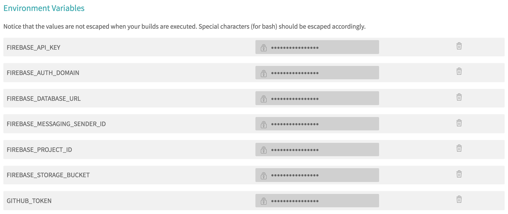

Berbagi pengalaman dalam menggunakan Firebase RTDB untuk membuat button Like sederhana seperti yang terlihat pada Blog 2.0

## Latar Belakang

Seperti sudah saya jelaskan pada tulisan sebelumnya bahwa Blog 2.0 ini hanyalah sebuah static Blog tanpa Backend, pun saya hanya menggunakan jasa static hosting dari Netlify untuk meletakan dan meyajikan file hasil build. Karena saya tidak menggunakan Backend dan tidak ingin menggunakannya, maka saya kesulitan ketika ingin menambahkan fitur yang mengharuskan saya menyimpan data di basis data (_database_ -DB) seperti jumlah orang yang _like_ suatu artikel. Data seperti itu jelas bukan data yang bisa disimpan di _browser_ masing-masing. Datanya harus terpusat dan semua pengunjung melihat jumlah yang sama. Data seperti ini paling ideal ada di DB, apapun jenis DB yang digunakan.

Dewasa ini untunglah ada platform seperti [Firebase ↗️](https://firebase.google.com/) yang membantu orang-orang yang males bikin Backend namun tetap bisa menyimpan data secara terpusat. Firebase bukan cuma menyediakan DB untuk kita tapi juga jasa lainnya seperti hosting, otentikasi, cloud storage, analytics, A/B testing, remote config, dynamic link dan berbagai hal keren lainnya. Firebase ini ibarat paket komplit kalau kita mau beli makan siang.

Kali ini kita hanya akan menggunakan fitur real-time databasenya saja.


## Membuat Projek di Firebase

Pertama kalian harus membuat projek di [Firebase Console ↗️](https://console.firebase.google.com/), kalian bisa memberi nama apapun pada projek kalian tapi nama ini memang harus unik dan belum pernah digunakan oleh orang lain.

Berikutnya kalian akan disuguhi pilihan untuk melakukan setup pada Firebase yang berbeda-beda tergantung jenis projek kalian, kita bisa memilih untuk web dan akan diberikan kode untuk memasang Firebase seperti berikut:

```html
<script src="https://www.gstatic.com/firebasejs/5.8.3/firebase.js"></script>
<script>
  // Initialize Firebase
  var config = {
    apiKey: 'QWERTY-YTREWQ',
    authDomain: 'contoh-aja.firebaseapp.com',
    databaseURL: 'https://contoh-aja.firebaseio.com',
    projectId: 'contoh-aja',
    storageBucket: 'contoh-aja.appspot.com',
    messagingSenderId: '1234567890',
  };
  firebase.initializeApp(config);
</script>
```

Kita tidak bisa _copy-paste_ kode ini mentah-mentah, karena projek Blog 2.0 menggunakan Nuxt sebagai framework dan tentu berbeda sedikit cara menggunakannya.

Sebelum mulai menyiapkan konfigurasi, saya memilih untuk meletakan nilai-nilai konfigurasi ini kedalam file `.env` agar mudah diubah-ubah nantinya.

Saya membuat file `.env` dengan isi berdasarkan konfigurasi yang didapat dari Firebase seperti berikut:

```bash
FIREBASE_API_KEY= your firebase `apiKey` config
FIREBASE_AUTH_DOMAIN= your firebase `authDomain` config
FIREBASE_DATABASE_URL= your firebase `databaseURL` config
FIREBASE_PROJECT_ID= your firebase `projectId` config
FIREBASE_STORAGE_BUCKET= your firebase `storageBucket` config
FIREBASE_MESSAGING_SENDER_ID= your firebase `messagingSenderId` config
```

Di Nuxt.js saya menambahkan module `@nuxtjs/dotenv` di file `nuxt.config.js` agar bisa membaca nilai dari `.env` ini, namun belakangan saya mendapati kalau nilai ini tidak diganti ketika proses generate file static dilakukan oleh Nuxt. Saya perlu menambahkan kode berikut pada file `nuxt.config.js` saya:

```javascript
module.exports = {
  env: {
    FIREBASE_API_KEY: process.env.FIREBASE_API_KEY,
    FIREBASE_AUTH_DOMAIN: process.env.FIREBASE_AUTH_DOMAIN,
    FIREBASE_DATABASE_URL: process.env.FIREBASE_DATABASE_URL,
    FIREBASE_PROJECT_ID: process.env.FIREBASE_PROJECT_ID,
    FIREBASE_STORAGE_BUCKET: process.env.FIREBASE_STORAGE_BUCKET,
    FIREBASE_MESSAGING_SENDER_ID: process.env.FIREBASE_MESSAGING_SENDER_ID,
  },
};
```

## Menyiapkan Kode Konfigurasi

Untuk membuka koneksi ke Firebase, saya membutuhkan dependency `firebase` yang bisa dipasang lewat perintah

```bash
$ yarn add firebase
# atau
$ npm i firebase
```

Saya memilih untuk meletakan koneksi firebase ini ke dalam folder `plugins` di struktur Nuxt, ini artinya akan ditambahkan di semua halaman yang ada di dalam projek ini.

Saya membuat file `plugins/firebase.js` dan membuat koneksi ke Firebase dengan kode berikut:

```javascript
import Vue from 'vue';
const firebase = require('firebase/app');
require('firebase/database');

var config = {
  apiKey: process.env.FIREBASE_API_KEY || '',
  authDomain: process.env.FIREBASE_AUTH_DOMAIN || '',
  databaseURL: process.env.FIREBASE_DATABASE_URL || '',
  projectId: process.env.FIREBASE_PROJECT_ID || '',
  storageBucket: process.env.FIREBASE_STORAGE_BUCKET || '',
  messagingSenderId: process.env.FIREBASE_MESSAGING_SENDER_ID || '',
};

firebase.initializeApp(config);
Vue.prototype.$firebase = firebase;
```

Selain membuka koneksi ke Firebase saya juga melakukan injeksi objek firebase yang telah disiapkan kedalam _instance_ dari Vue agar mudah dipakai di Vue Component nantinya.

Saya perlu menambahkan plugins ini di file `nuxt.config.js` agar terbaca di projek ini dengan kode seperti berikut:

```javascript
module.exports = {
  plugins: [
    { src: '~/plugins/firebase', ssr: false }
   ↗️]
}
```

Selain harus diinisialisasi, Firebase juga membutuhkan beberapa file seperti `firebase.json`, `.firebaserc` dan `database.rules.json`. File-file ini bisa didapatkan dengan perintah `firebase init` pada folder root projek kita. Namun sebelum itu kalian harus login ke dalam firebase terlebih dahulu dengan perintah `firebase login`.

Berikut contoh file `firebase.json` yang bisa kalian temui juga di projek ini:

```javascript
{
  "database": {
    "rules": "database.rules.json"
  }
}
```

Dan file `database.rules.json` seperti berikut yang artinya saya membiarkan pengguna mengakses database saya tanpa perlu login terlebih dahulu.

```javascript
{
  "rules": {
    ".read": "auth == null",
    ".write": "auth == null"
  }
}
```

## Menyiapkan Struktur Data

Struktur data dari Firebase DB ini tidak seperti basis data relasional, Firebase DB lebih seperti file JSON file biasa.

Saya membuat struktur data untuk menyimpan jumlah like pada setiap artikel seperti berikut:

```javascript
{
  "claps": {
    "create-simple-like-button-using-firebase-rtdb":0,"eslint-formatter-html-extended":0,
    "blog-2-0-in-nuxtjs":0
  }
}
```

Jika kalian malas, kalian juga bisa melakukan import dari data JSON yang sudah saya siapkan di file `firebase-db-export.json` pada projek Blog 2.0.

Jangan lupa untuk membuka akses untuk _read_ dan _write_ pada tab `Rules`:

```javascript
{
  "rules": {
    ".read": true,
    ".write": true
  }
}
```

## Membaca dan Memperbarui Data

Firebase terbilang cukup mudah untuk digunakan dengan Vue ataupun Nuxt, kita akan mencoba membaca data yang telah kita buat di Firebase DB di dalam Vue Component kita.

Saya meletakan di _life cycle_ `mounted` di Vue Component kode berikut:

```javascript
// this is vue component instance
const __self = this;
const REF_URL = 'claps/' + __self.meta.slug;
__self.clapsRefs = __self.$firebase.database().ref(REF_URL);
__self.clapsRefs.once('value').then(function (snapshot) {
  __self.claps = snapshot.val();
});
```

Sebelumnya tentu saya harus menyiapkan state `clapsRefs` dan `claps` di bagian `data ()` sebagai penampung nilai tersebut.

Kode diatas digunakan untuk menginisialisai nilai berdasarkan data yang ada di Firebase DB, bagaimana kalau ada perubahan nilai pada Firebase DB kita? karena kita menggunakan Firebase Realtime-DB maka akan sangat mudah bagi kita untuk mendengarkan setiap perubahan yang terjadi dan saar itu pula langsung bereaksi dengan memperbarui tampilan jumlah _like_ yang ditampilkan. Kode untuk mendengarkan perubahan secara realtime kurang lebih sebagai berikut:

```javascript
// this is vue component instance
const __self = this;
__self.clapsRefs.on('value', function (snapshot) {
  __self.claps = snapshot.val();
});
```

Sementara untuk memperbarui nilai di DB kita juga tidak kalah mudahnya, cukup dengan kode `set` pada referensi yang telah kita dapatkan, seperti contoh berikut:

```javascript
// this is vue component instance
if (this.clapsRefs) {
  this.clapsRefs.set(this.claps + 1);
}
```

## Travis CI Konfigurasi

Sentuhan terkhir adalah memastikan ketika proses build kita menyetel nilai _environment variable_ dengan nilai asli sesuai dengan apa yang kita gunakan di prodcution. Bila pada saat di lokal kita bisa menggunakan file `.env` yang tidak mungkin kita push ke repository.

Di [Travis CI ↗️](https://travis-ci.org) kita juga bisa menyetel berbagai variabel dengan mudah. Cukup masuk ke bagian `settings` dan kita bisa menambahkan _key-value_ sebagai variabel yang akan diikutkan saat proses _build_.



### Demikian artikel kali ini, semoga bermanfaat...
