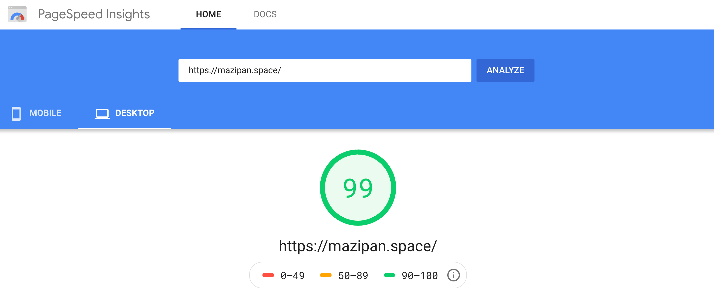
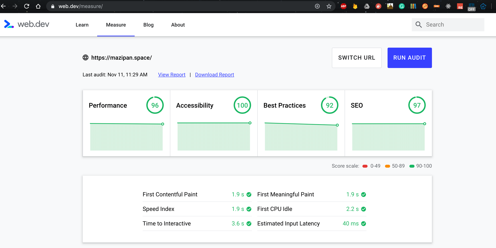
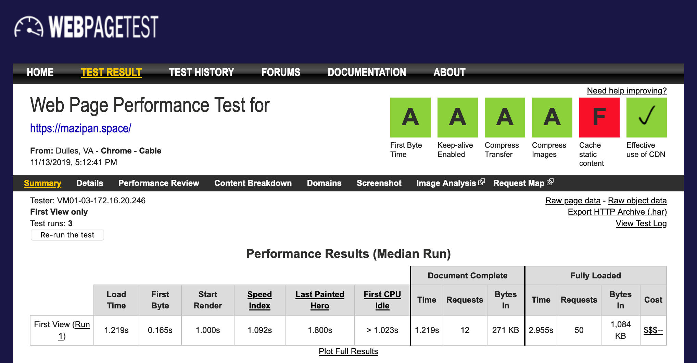
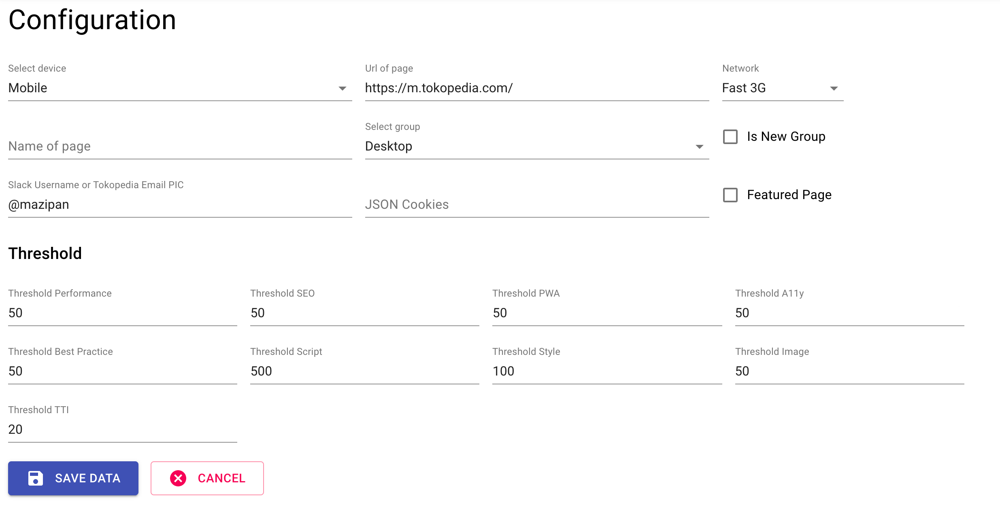
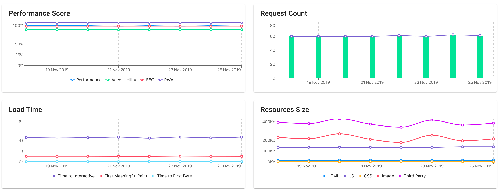
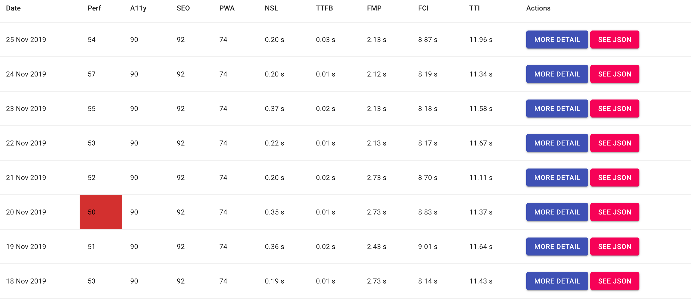
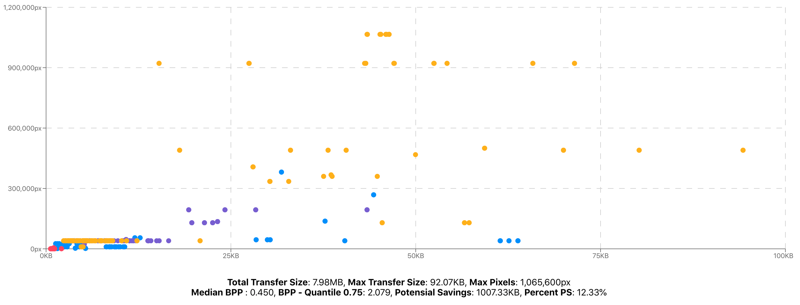

Story from Tokopedia web platform team in building an in-house web metric monitoring dashboard for not just make a  fast web but keep that page in fast mode.

## Disclaimer

Before we starting, you need to take note that all in this article is my own words. It may be wrong, subjective and doesn't work well with your current situation. Do not take any decisions based on only this article.

## About Web Metric Monitoring

Monitoring is one of the tasks you need to think about when you decided on any technologies.
Especially when we plan to use it in a production environment.
This is because monitoring with any tools can give us better visibility about our current product or technology in production.
With good monitoring tools, we can an insight into our current condition and creating another plan for fixing or improving the product based on the data we get from the monitoring tools.

In terms of web technology, there are many metrics we can monitor for a day to day operations.
Specific in frontend web technology there are some key metrics we need to monitor because it might be impacted on your product impressions in the end-user.

For the higher position stakeholders, they need to take a look at a big picture of the web metrics.
Showing how long it takes your web to be loaded is the one you should do for them.
But as web developers, we need to care about other metrics that direct or indirect will cause increasing or decreasing the web load time.
That's why we need to take much more data than just the load time itself.

## Mainstream Monitoring Tools

In the industry, there is some alternative we can use to do monitoring our web metrics.
You can use [pagespeed insight](https://developers.google.com/speed/pagespeed/insights/), [web.dev/measure](https://web.dev/measure/), [webpagetest.org](https://www.webpagetest.org/), and many others website we can use for monitor our web metrics.

### Pagespeed Insight



When we say, you must monitor your web metrics day by day so you can see the changes in every code deployed to the production, how it will impact these metrics, which deployment that causes decreasing your web metrics or is your initiative can increase your web metrics such as a performance score.
In this scenario, we can use Pagespeed Insight because it can not record your day to day changes. Except you want to do a manual screenshot of the report every time.
But it's not because of Pagespeed Insight is bad, sure you can take a look at a report aggregated from Chrome UX Report in the Pagespeed Insight.
Those kinds of report might never be provided by any other tools.
You can see how long the average for real users using the Chrome browser accessing your web.

Is it included in a fast category, medium or slow?

Watch the video about [Using the Chrome UX report to evaluate real-user data](https://www.youtube.com/watch?v=UvK9zAsSM8Q) from  Google I/O 2018

### Web.dev



Move to **[web.dev/measure](https://web.dev/measure/)**, it is just running the lighthouse engine under the hood.
Yes, the lighthouse is one of the most popular engines used to test your web page and get a rich report from summary one until the details one.
It also gives you a clear recommendation on how to tackle issues detected by the lighthouse to be action items for your next improvement.

**Web.dev/measure** also can record your last test and compare it to your current test report.
It give you a better visibility about the trends and the changes.
You can unlock this feature with log in to your Google account and web.dev will save the data based on the login account.
I still didn't know how to automate these jobs.

Yes, I am lazy and didn't want to open the web.dev every day and testing my web page to record my web page test.
Also how if we need to analyze custom data since the web.dev only shows the generic report and didn't compare the data as we want to.

### Webpagetest



The last, Webpagetest.org is one of the most powerful sites to be used to monitor your web page metrics.
It already supports the lighthouse engine if you need it.
Webpagetest can be used easily without any account login and you can get the same (even richer) report compare to Pagespeed Insight and Web.dev.
But yeah, you need to do this manually and we don't want it.

The good news is Webpagetest also gives you an API you can hit from anywhere you want and give you the same report in the response.
You need to register and get your API key to use this feature, you can visit this [request API key page](https://www.webpagetest.org/getkey.php).
There are some limitations in this API like you can only hit 200 page-load every day.
In every one running the test, webpagetest will run 10 times to get a more consistent report.
It will cause a reduction by 10 rate limit in every API call.
Yes, it might be not scaled for some cases.

Honestly, we already tried it.

Creating our web metrics monitoring tools which hit webpagetest API every day with Crob job triggered in the midnight.
Our big problem is we can not add more pages to be analyzed by webpagetest because of the rate limiter.
That's why we start to look at another solution that scales better.
Another solution with nearly the same with webpagetest and still gives us the flexibility of creating our reporters based on the data we collect.

## Lighthouse FTW

Lighthouse gain it's popularity because Progressive Web Apps (PWA) also becomes the hottest topic in modern web development.
Developers need tools to test it's PWA implementation, see the result score and get the best practices checklists that can be applied in their web.
This phenomenon drives us to use the Lighthouse engine for our next web metrics monitoring dashboard.


Lighthouse engine is available in many alternatives, it's built-in by default with our Chrome DevTools, it available as a CI that can validate our pull requests, it available as an NPM library along with Puppeteer for launching a Chrome browser programmatically.
It also available as a CLI tool if you prefer a simpler usage.
CLI tools from Lighthouse can produce a JSON or HTML file as an output.
CLI tools can be very flexible for you to develop custom reporting.
You can pass Cookies, extra headers, blocking some domain from page load, and passing your network throttle to simulate your dominant user's network.
Read [the complete available CLI options](https://github.com/GoogleChrome/lighthouse#cli-options) from Lighthouse CLI.

Without complex options, you can call lighthouse with basic code:

```bash
# Change with your URL
npx lighthouse https://m.tokopedia.com/ --output json --chrome-flags="--headless"
```

Or if you prefer using Node.js script, you can call lighthouse with code:

```js
const lighthouse = require('lighthouse');
const chromeLauncher = require('chrome-launcher');

function launchChromeAndRunLighthouse(url, opts, config = null) {
  return chromeLauncher.launch({chromeFlags: opts.chromeFlags}).then(chrome => {
    opts.port = chrome.port;
    return lighthouse(url, opts, config).then(results => {
      // use results.lhr for the JS-consumeable output
      // https://github.com/GoogleChrome/lighthouse/blob/master/types/lhr.d.ts
      // use results.report for the HTML/JSON/CSV output as a string
      // use results.artifacts for the trace/screenshots/other specific case you need (rarer)
      return chrome.kill().then(() => results.lhr)
    });
  });
}

const opts = {
  chromeFlags: ['--show-paint-rects']
};

// Usage:
launchChromeAndRunLighthouse('https://example.com', opts).then(results => {
  // Use results!
});
```

You need to add lighthouse module and chrome laucher via NPM:

```
yarn add --dev lighthouse chrome-launcher
```

Read [Using Lighthouse programmatically](https://github.com/GoogleChrome/lighthouse/blob/master/docs/readme.md#using-programmatically) for help getting started.

Lighthouse by default will use Fast 3G as their network throttle base, it might not fit with your needs.
Read more about [throttling docs](https://github.com/GoogleChrome/lighthouse/blob/master/docs/throttling.md) for getting-know how Lighthouse doing throttle into your test.

The problem is the JSON report may be too big for you to save in the disk or database, since you may never use all the data in the JSON file. You need to pick the data that you think important for your developers and other stakeholders and remove the rest of it.
But if you doing this, your report may be will become invalid to be viewed by any other lighthouse report viewer like [the official lighthouse previewer](https://googlechrome.github.io/lighthouse/viewer/).

[Sample of Lighthouse report in JSON file](https://gist.github.com/paulirish/a207a43c8164a7ab728481b496aa8a27#file-localhost_2018-03-12_17-55-45-lighthouse-report-json).
Here is the important data you should save from the JSON:

```javascript

{
  fetchTime: 'time when the report generated',
  finalUrl: 'tested URL by lighthouse',
  audits: {
    'first-contentful-paint': {},
    'first-meaningful-paint': {},
    'speed-index': {},
    'estimated-input-latency': {},
    'time-to-first-byte': {},
    'first-cpu-idle': {},
    'interactive': {},
    'network-requests': {},
    // ...other
  },
  categories: {
    'performance': {},
    'accessibility': {},
    'best-practices': {},
    'seo': {},
    'pwa': {},
  }
}
```

After trying to run the lighthouse CI several times, you might realize that the result has some variability even you test it with the same setup or config.
The result depends on many things including your network condition when running the test.
Because of this variability, Lighthouse recommends us to run lighthouse several times to get better consistency and accuracy in the result.
You can increase the number of hits per run until you get stability and confidence with the result.
Currently, we decide to run 5 times per run.

You can read the public doc for [Lighthouse Metric Variability and Accuracy](https://docs.google.com/document/d/1BqtL-nG53rxWOI5RO0pItSRPowZVnYJ_gBEQCJ5EeUE/edit#heading=h.bdv52es24upi).

## Tech inside

We built our dashboard monitoring tools on top of Docker container.
Developing websites using docker also have better developer experience since we don't need to force the developers to install program A to Z just to make it run in their local machine.
For the deployment part, we also have more portability with Docker.

Our web apps are just simply a client-server app, using MongoDB as database storage.
The server built using [Express.js](https://expressjs.com/) and [Apollo GraphQL](https://www.apollographql.com/) for a gateway with our client app. We choose to open a web socket secure protocol instead of HTTP request. It can be achieved with a very simple code in Apollo GraphQL.

We use [Mongoose.js](https://mongoosejs.com/) for Object Document Modelling (ODM) as a bridge for accessing our MongoDB. It seems easier to use than the native Mongo one.

For the client, we rely on [React](https://reactjs.org/) and [Material UI](https://material-ui.com/) as a backbone UI Kit for faster prototyping because we didn't want to spend too much time in the design part, we just simply use the Material UI components and it works magically.
When developing a dashboard monitoring you'll face many Chart building blocks. We use [Recharts](http://recharts.org/en-US/) because of the simplicity.

All written in [TypeScript](https://www.typescriptlang.org/) 🙊

## Task Flow

Our dashboard has Cron Job that executed daily, run in the midnight, call our Lighthouse CLI custom script, running for all pages we already set before.
Running 5 times for each page, get the median value of it, then save the report to MongoDB.

We also have config page to set thresholds for some metrics like Time to Interactive, Performance Score, Size of Script, CSS, and Images for each page.
This threshold acts as a gate that will keep sending an alert to slack when the score is under our expectation.

We know that we are too lazy to check the dashboard frequently, that's why sending a direct notification to Slack is one of our solutions to increasing the awareness of our developers and other stakeholders.



After the data is stored, we can show the result in a Chart as we want. In our cases, we show a chart for total requests per page, size of resources, performance and PWA score, and web page load timing.
The data is already there, we just need to explore to show the most important data for our self.






## Image Analyzer

We know that image is one of the biggest cost in the websites. Monitor all the images requested in the first load of your websites become a mandatory task because it will give us a visibility about the image that not optimized and creating action items from our finding then distributed to the person who in charge with the image.

From lighthouse report, you can grep all the data images after you hit the lighthouse job.

You can deep dive your report on the field:

```javascript
// let say we have JS object `report` from lighthouse
// then we can get the images from this field
const report  = {}
const IMAGE_REGEX = /\.(jpe?g|png|gif|tiff|bmp|webp|svg)$/i

const allImagesFromLighthouse = report.audits["network-requests"].details.items.filter(i => i.resourceType === "Image" && IMAGE_REGEX.test(i.url) )
```

Unfortunately, we only get the data about `resourceSize` (original size) and `transferSize` (compressed size) from lighthouse. It will not good for us to create the presentations based on this data only. Thanks for npm module [image-size](https://www.npmjs.com/package/image-size), we can get more information about dimension of the image with this module.



## Alternatives

You might don't need to develop your monitoring dashboard like us.
Here are some best free alternatives tools we found for you:

- [Sitespeed.io](https://www.sitespeed.io/)
