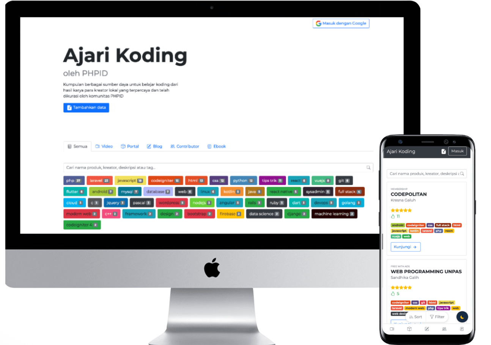
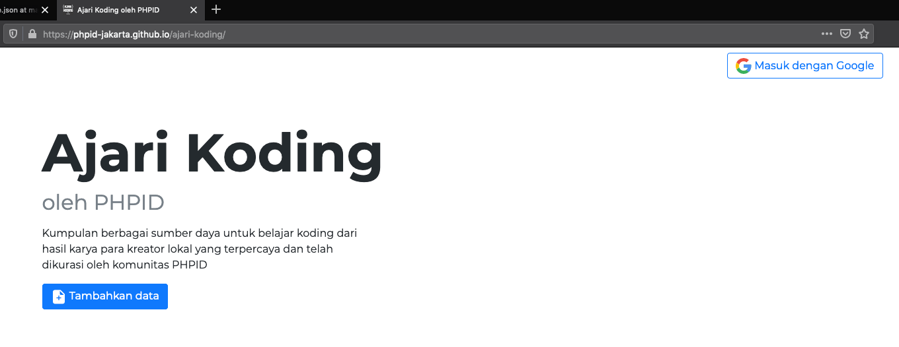
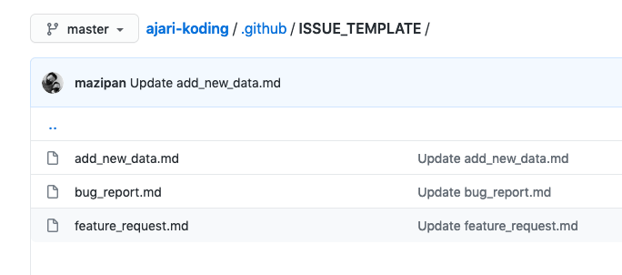

Beberapa waktu yang lalu saya dihubungi om [Peter Jack Kambey](https://www.facebook.com/peterjkambey), ya beliau memang sering menghubungi saya secara personal baik sekadar menanyakan kabar, mengucapkan selamat atas apa hal luar biasa yang terjadi di hidup saya atau bertukar pikiran mengenai projek yang ingin dijalankan. Kali ini beliau membuka obrolan bahwa beliau sedang terinspirasi ingin membuat satu halaman untuk tautan baik blog maupun video tutorial yang memang sangat sering sekali dipublikasikan di grup [Facebook PHPID](https://www.facebook.com/groups/phpid/). Beliau menambahkan bahwa dengan begini kita bisa mengkategorikan berbagai sumber daya ini. Kita bisa membedakan mana yang gratis, mana yang berbayar, mana yang bagus, mana yang masih butuh peningkatan kualitas.

Sebelumnya, ini memang bukan kali pertama om Peter menyampaikan berbagai keinginannya membuat sesuatu yang dirasa meolong teman-teman di group yang diasuhnya PHPID. Saya pernah membantu membuatkan web untuk acara SME Summit, beberapa landing page kilat, serta berbagai obrolan yang tidak pernah terealisasi adanya. Terakhir kali saya membantu membuatkan daftar untuk [Belajar Daring](https://s.id/phpid-learning) yang diadakan PHPID selama kondisi bekerja dari rumah ini, tentu saja alasannya karena saya pribadi malas diminta scroll halaman grup Facebook mereka yang hampir tiap 5 menit ada saja pos terbaru. Kalian bisa melihat beberapa projek lainnya di [Github PHPID-Jakarta](https://github.com/phpid-jakarta)

## Memperkenalkan Ajari Koding

Cara termudah dalam mengumpulkan data ini adalah dengan membuat daftar di Github (ya, saya memang lebih aktif di Github dibandingkan sosial media saya) atau yang biasanya dikenal dngan *awesome-list*. Idenya adalah mengumpulkan berbagai sumber daya ke dalam satu wadah yang mudah dibaca, yakni `readme.md` kalau di repositori. Kenapa di `readme.md`? karena ini pintu masuknya, semua orang bisa dengan mudah melihatnya tanpa perlu lagi navigasi ke dalam repositorinya lebih dalam lagi. Sayangnya menempatkan data di `readme.md` ini juga ribet, apalagi kalau datanya membengkak dengan cepat. Salah satu solusi lain ya mmindahkan ke tampilan Web terpisah sehingga bisa dicari dengan lebih mudah, bisa disaring dan diurutkan sesuai kehendak kita.

Saya menginisiasi projek ini dengan nama "Ajari Koding", sesimpel karena saya kepikirannya itu.
Tidak ada arti yang mendalam apalagi visi misi yang gamblang.



Projek seperti "Ajari Koding" cuma akan menjadi sampah kalau tidak ada yang mau membantu melengkapi koleksi data yang ada di dalamnya. Syukurlah om Peter punya kemampuan marketing dan punya banyak pengikut yang bisa dengan cepat melejitkan nama projek ini.

Sialnya si projek belum siap ketika disebarkan, saya cuma menginisiasi sebuah *awesome-list*.

## Wujudkan dulu, perbaiki kmudian

Yap, tak perlu menunggu waktu lama sejak obrolan dengan om Peter dimulai. Saya beberapa waktu setelahnya langsung memberikan kabar kalau saya sudah membuatkan repositori untuk projek ini dan menjelaskan sedikit kalau nantinya akan begini dan begitu.

Sebelum mendapatkan data dari luar saya dan om Peter mencoba mencari contoh data yang bisa digunakan agar bisa kepikiran bagaimana cara memproses datanya untuk digunakan oleh Web nantinya. Data didapatkan, template untuk menambahkan data baru disiapkan, waktunya mulai coding!

### Membuat parser

Dengan mengerti gambaran kecil bagaimana datanya akan ditata di `readme.md`, saya bisa menentukan saya harus menggunakan apa untuk memproses datanya. Saya memulai dengan membuat *parser* untuk datanya. Untuk membuat *parser* saya menggunakan Node.js (saya bisanya itu), dengan memanfaatkan pustaka `markdown-it` untuk mengubah menjadi HTML dan `cheerio` untuk melakukan seleksi dari elemen HTML yang ada.

kalian bisa melihat kod yang sudah saya sederhanakan brikut:

```js
const fs = require('fs')
const path = require('path')
const cheerio = require('cheerio')
const MarkdownIt = require('markdown-it')
const md = new MarkdownIt()

const readmeContent = await fs.readFileSync(path.resolve('./README.md'), {
  encoding: 'utf-8'
})

// Parsing menjadi HTML string
const html = md.render(readmeContent)

const $ = cheerio.load(html)

// Mengambil semua `h3` dan mencari `ul` terdekatnya untuk kemudian mengambil data `li` anaknya
const jsonResult = $('h3')
  .map((i, el) => {
    return $(el)
      .next('ul')
      .children()
      .map((_, li) => {
        return $(li).text()
      })
      .get()
  }).get()
```

Setelah berhasil melakukan *parsing* data kemudian saya menuliskan hasilnya ke sebuah berkas dalam repositori.

### Membuat otomasi parser

Setelah selesai membuat *parser*, berikutnya saya memastikan kalau saya tidak perlu manual menjalankan *parser* ini di lokal mesin saya. Karenanya, saya memanfaatkan Github Action untuk menjalankan parser setiap kali ada penambahan data baru. kalau kalian pernah membaca artikel [Membuat commit otomatis ke Github](/membuat-commit-otomatis-ke-github/) pastinya sedikit banyak mengerti bagaimana cara saya membuat kode sederhana untuk otomasi hal seperti ini.

Berikut saya sematkan potongan kode konfigurasi workflow di Github Actions sampai saat tulisan ini dipublikasikan:

```yaml
name: Generate JSON
'on':
  push:
    branches:
      - master
jobs:
  generate_json:
    runs-on: ubuntu-latest
    steps:
      - name: Checkout code
        uses: actions/checkout@v2
        with:
          persist-credentials: false
          fetch-depth: 0
      - name: Use node 12
        uses: actions/setup-node@v1
        with:
          node-version: 12.x
      - name: Get yarn cache
        id: yarn-cache
        run: 'echo "::set-output name=dir::$(yarn cache dir)"'
      - name: Cache Node.js modules
        uses: actions/cache@v1
        with:
          path: '${{ steps.yarn-cache.outputs.dir }}'
          key: '${{ runner.OS }}-yarn-${{ hashFiles(''**/yarn.lock'') }}'
          restore-keys: |
            ${{ runner.OS }}-yarn-
      - name: Install dependencies
        run: yarn
      - name: Generate file json
        run: yarn toJson
      - name: Commit files report
        run: |
          git config --local user.email "actions@github.com"
          git config --local user.name "Github Actions"
          git add -A
          git commit -m "✅ [Github Actions]: Generate json file"
      - name: GitHub Push
        uses: ad-m/github-push-action@v0.5.0
        with:
          github_token: '${{ secrets.GITHUB_TOKEN }}'
          force: true
```

### Membuat Web UI

Memilih-milih framework javaScript apa yang mau dicoba, ya bebrapa kali saya memang memanfaatkan projek open-source sebagai wahana untuk mencoba dan belajar teknologi atau framework yang saya tidak punya kesempatan banyak untuk menggunakannya di pekerjaan sehari-hari.

Setelah menimbang-nimbang, rasanya saya belum punya pengalaman yang cukup baik dengan **Svelte**, jadi saya memilih menggunakannya saja untuk kali ini.

Masih terlalu buta dengan Svelte, saya tidak berani banyak tingkah. Cukup bagi saya menggunakan template bawaan yang sudah disediakan oleh official dokumentasi mereka. Bermodalkan artikel "[The easiest way to get started with Svelte](https://svelte.dev/blog/the-easiest-way-to-get-started)" saya pun berani memulai projek ini dengan Svelte.

Memulai Svelte sendiri bisa dikerjakan dengan sesederhana mengetikkan perintah:

```bash
$ npx degit sveltejs/template ajari-koding
```

Belum lama ini saya membaca artikel "[Bootstrap 5 alpha!](https://blog.getbootstrap.com/2020/06/16/bootstrap-5-alpha/)", ini framework yang memang tidak begitu dekat dengan saya dalam beberapa tahun belakangan dikarenakan memang tidak daigunakan dalam hampir sepanjang karir saya sebagai Frontend Developer. Membaca artikel tersebut, seperti berhasil mengubah pandangan buruk saya terhadap CSS framework ini. Yap, kali ini BS bersih dari JavaScript yang tidak semua orang butuhkan. Ini emnjadikan semakin mudah untuk memasang pada projek yang notabeni berbasiskan framework JavaScript modern yang biasanya menghindari penggunaan pustaka terlalu banyak.

Jadilah kombinasi Svelte x Bootstrap 5 Alpha ini sebagai fondasi bagi projek Ajari Koding kali ini.

Saya memilih menggunakan CDN dari Bootstrap untuk mulai menggunakan CSS ini, dikarenakan saya tidak ingin banyak setup di level Build tool terlebih dahulu, saya lebih baik mengalihkan energi saya untuk mengerjakan hal lain yang lebih fundamental. Menambahkan CDN Bootstrap sendiri cukup mudah, tinggal mencari HTML Entry dan diselipkan tag berikut:

```html
<link rel="stylesheet" href="https://stackpath.bootstrapcdn.com/bootstrap/5.0.0-alpha1/css/bootstrap.min.css"
    integrity="sha384-r4NyP46KrjDleawBgD5tp8Y7UzmLA05oM1iAEQ17CSuDqnUK2+k9luXQOfXJCJ4I" crossorigin="anonymous">
```

Saya tidak menambahkan Script pendamping apapun selain hanya CSS ini, semua interaksi akan saya kerjakan di level Svelte saja tanpa bantuan dari Script dari Bootstrap dan pendukungnya.

### Migrasi ke Sapper

Awal saya inisialisassi projek ini, saya tidak punya banyak kesempatan untuk membaca dengan benar dokumentasi yang ada.
Saya hanya ingin menggunakan Svelete saja.
Selang waktu brjalan, saya membaca mengenai Sapper di Svelte yang mana seperti Next.js di React.js atau Nuxt.js di Vue.js.
Ini supeer set framework yang dibangun diatas Svelte dengan tujuan membangun aplikasi yang lebih kompleks dan mndukung SSR.
Seperti kemampuan Next.js dan nuxt.js, Sapper ini juga dapat memproduksi static files dari hasil kode yang ada.
Ini pilihan yang lebih baik menurut saya, apalagi dengan template Svelte yang sebelumnya saya belum sepmpat setup untuk routing sederhana dan store untuk state management. Di Sapper semua sudah disiapkan dari awal.

Proses migrasinya sendiri tidak begitu susah, justru menyesuaikan agar ini tetap mulus dengan lingkungan yang saya punya yang lumayan menghabiskan waktu karena harus korek-korek dokumentasinya.

Saya menggunakan Github Pages untuk host projek ini, yang mana punya `basepath` berbeda mengharuskan saya menambahkan parameter tambahan ketika membuat static file seperti berikut:

```bash
$ sapper export --basepath ajari-koding
```

### Menambahkan Database Sedehana

Ajari Koding membentuk tim kecil untuk melakukan kurasi dan memberikan rating pada item yang ada dalam daftar yang sudah diisikan oleh para kreator. Sayangnya cara ini oleh sebagian teman-teman menjadi terasa tidak begitu adil karena kita memang akan memberikan nilai secara sepihak tanpa persetujuan dari siapapun. Meskipun kita sebenarnya sudah mewanti-wanti dari jauh terkait hal ini, tapi tetap saja ada suara lirih yang menjadikan kita sebagai kambing berwarna hitam.

Saya pribadi memang sudah memiliki wacana untuk menambahkan fitur semacam "Like" atau "Clap" yang bisa disubmit oleh semua pengguna Ajari Koding. Setelah mendapatkan waktu yang cukup senggang, akhirnya saya coba eksplor terkait hal ini.

Saya memilih menggunakan Firebase untuk membantu saya mengerjakan fitur ini, selain karena saya peernah menggunakan si Real-Time Database dari Firebase ini, saya juga membutuhkan fitur otentikasi yang dimiliki Firebase.

Berikut tampilan dimana kalian bisa menekan tombol 👍 di masing-masing item yang kalian sukai:


Tombol tersebut hanya akan muncul setelah kalian login dengan akun Google terlebih dahulu



### Template untuk menambahkan Issue dan Pull-Request

hal ini dibutuhkan untuk emmudahkan teman-teman dalam berkontribusi, baik menambahkan galat yang ditemukan, permintaan fitur baru ataupun menambahkan data sumber daya terbaru.



## Mari mulai berkontribusi

Fakta bahwa PHPID adalah salah satu komunitas software developer terbesar di Indonesia, tidak lantas menjadikan semua hal menjadi mudah untuk menjalankan berbagai program maupun aktivitas yang ada di komunitas tersebut. Sebagai komunitas memang nyawanya ya ada di member di dalamnya, sekalipun ada beberapa pengurus yang ditunjuk tapi pada dasarnya mereka tidak akan bisa berjalan sendiri tanpa bantuan dari rekan-rekan member di dalamnya.

Tidak perlu terlalu jauh mikir "Bisa bantuin apa ya?", kita sama-sama belajar.

---

Semoga bermanfaat