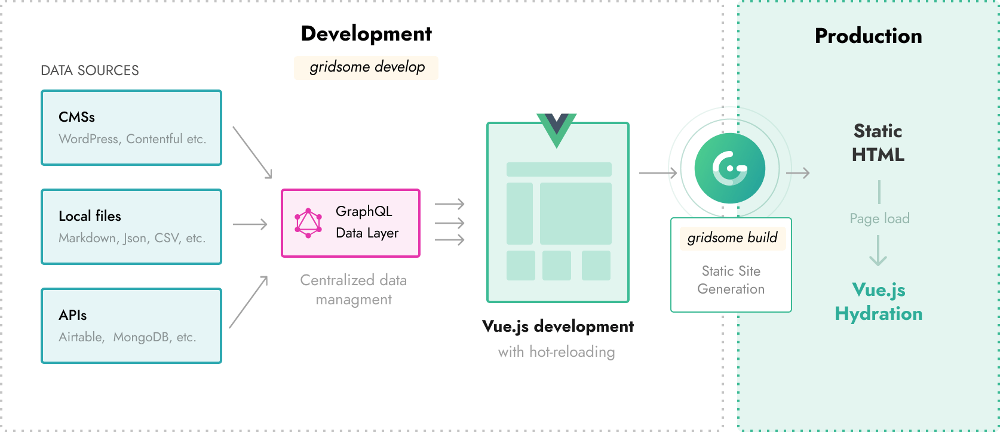

How to start creating awesome static Blogs using Gridsome - a Vue.js static site generator in a short time

## About Static Blog

"Static blog" is a blog that we create without using * backend *, so that we can deploy easily to various static hosts such as Github Pages, Netlify, Firebase, and others. This static blog usually uses templates like * Markdown * that will * build * shortly before * deploy * to produce static HTML, CSS, and JavaScript files.

## What is Gridsome?


[Gridsome ↗️](https://gridsome.org/) is a new kid in the Vue.js ecosystem that specializes in creating static pages. If you are a React.js user, of course you are familiar with the name [Gatsby ↗️](https://www.gatsbyjs.org/) as one of the best static page generator at the moment. Well, Gridsome was very inspired by Gatsby in the React.js ecosystem.

It's not new that the ecosystem in Vue is not as strong as and as complete as React, but I am always amazed by those who are struggling to make alternatives to many great things to react to Vue. Gridsome, like will follow the success of Nuxt in trying to adopt Next.js on React. Nuxt today has become the best choice when making an any application on Vue.

## Why is Gridsome better than Nuxt?

Nuxt is basically intended to create web applications in Vue that require rendering on a server, Nuxt is more specifically very prepared to handle a variety of complex needs that usually arise when creating a web application. Although Nuxt has the ability to generate static files that we can use to create static blogs, actually this is a function that is nice to have for Nuxt.

While Gridsome is a player who has specialists in this section. Gridsome has *generate* features that are armed with various *built-in* other features needed when creating static blogs such as automatic *code-splitting*, image compression, full PWA support, and of course the very friendly with SEO. We can also easily organize our content files with **Markdown** without the need for any additional configuration. If you look at the [Blog 2.0 repository↗️](/blog-2-0-in-nuxtjs) that I made with Nuxt, of course you will know that I have to do various "cheats" to do the same thing.



## Create awesome blog with Gridsome

Creating a blog with Gridsome is now made easier by the *starter template* which in my opinion is quite complete for the general needs of a blog.

Gridsome already make a starter [gridsome-starter-blog ↗️](https://github.com/gridsome/gridsome-starter-blog) that you can use quickly and easily for the first time. Using a starter like this will reduce a lot of burden up front to do many configurations which of course will be confusing for beginners like me.

Here are more or less the steps to creating a blog using Gridsome's template starter:

**1. Install Gridsome CLI**

```bash
$ npm install --global @gridsome/cli
```

**2. Create new project using `gridsome-starter-blog`**

```bash
$ gridsome create gridsome-blog https://github.com/gridsome/gridsome-starter-blog.git
```

**3. Running in local environment**

```bash
$ gridsome develop
```

**4. Generate static files**

```bash
$ gridsome build
```

You can see the results of creating a Blog with gridsome starter in the repository [https://github.com/mazipan/gridsome-blog ↗️](https://github.com/mazipan/gridsome-blog)

## Deploy to Netlify

To deploy Gridsome to Netlify is also very easy, even Gridsome also provides official documentation about the steps on the page [deploy-to-netlify ↗️](https://gridsome.org/docs/deploy-to-netlify), which are more or less the following:

1) Create new project in Netlify

2) Adding command `gridsome build` in *build command* field

3) Add directory `dist` in *publish directory* field

4) You can see the result in [https://gridsome-blog.netlify.com/ ↗️](https://gridsome-blog.netlify.com/)

## Adding new article/post

1) All articles are under `/content/posts` directory using Markdown file which has `.md` extension.

2) We just add a new file with the file name which will later be the url of the article.

3) Create a meta data for your new article, like the following example:

```yaml
---
title: Create awesome blog with Gridsome
slug: create-awesome-blog-with-gridsome
date: '2019-03-14'
minute2read: 10
description: How to start creating awesome static Blogs using Gridsome - a Vue.js static site generator in a short time
layout: layouts/post.njk
author: mazipan
draft: false
tags: [javascript, gridsome]
---
```

4) We can add images to related articles in the `/content/posts/images` directory, and simply link with the usual Markdown code like ``

5) We can change the configuration of the blog name and blog description in the `gridsome.config.js` file

## Adding sitemap.xml support

Unfortunately, the default template has not been embedded in support to create `sitemap.xml`, so here we will add it ourselves in the following way:

1. Adding dependency

```bash
yarn add @gridsome/plugin-sitemap
```

2. Add `siteUrl` in the `gridsome.config.js` file with the production URL value from our blog

3. Add a configuration for the sitemap in the `gridsome.config.js` file on the `plugins` property, as shown below:

```javascript
module.exports = {
  plugins: [
    {
      use: '@gridsome/plugin-sitemap',
      options: {
        cacheTime: 600000, // default
        exclude: ['/exclude-me'],
        config: {
          '/articles/*': {
            changefreq: 'weekly',
            priority: 0.5
          },
          '/about': {
            changefreq: 'monthly',
            priority: 0.7
          }
        }
      }
    }
  ]
}
```

### May useful for you...
