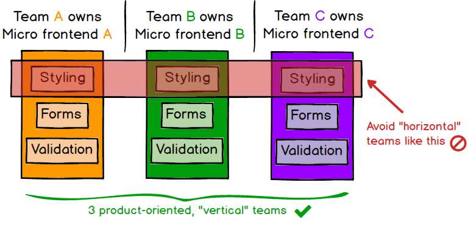
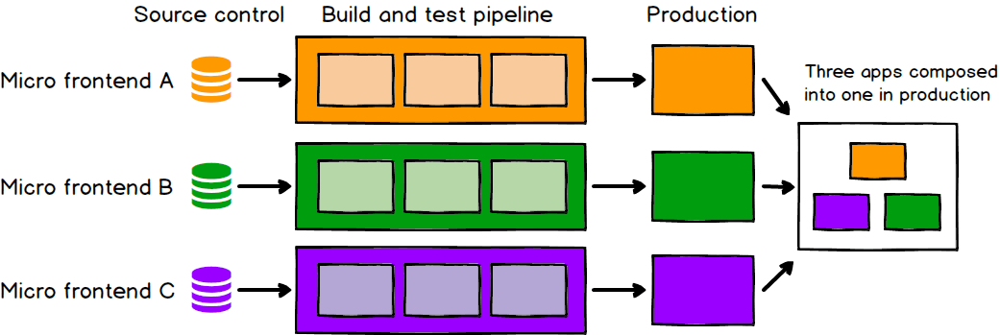

Story telling about Micro-Frontend from both sides, the benefits and the problems

## Disclaimer

Before we starting, you need to take a note that all in this article is my own words. It may be wrong, subjective and doesn't works well with your current situtations. Do not take any decisions based on only this article.

## About Micro Frontend

You might ever heard the term of *Micro Frontends* (MFE), basically its adopt from the concept of *Micro Services* in backend area. When the backend already split into several services that independent each other and deploying into different server, many of frontend code still write in the one big codebase and deploy into one big server to serve all of web pages. How if the frontend can be splitted also into several different services? Not just split by its page, but until a component level.

MFE is a concept to splitting the frontend code by it's functionality relation not just by it's route. MFE can serving one page from many different sources that coming from different servers and shipped by a different teams.

## What's the MFE sells to Us?

MFE coming with many strong point that makes you as a developers interest in it. We will try to describe some of it in this below lists:

#### Technology stack isolation

MFE enable possibility to use different technology stack in Frontend. Let's say you want to develop header fragment using React, then you switch to Vue when developing the sidebar fragment. It possible with the isolation concept brings by MFE.

#### Autonomous teams

This is maybe the coolest thing in MFE, you can have seperate teams which normally composed by different specialized person, like you can have one frontend developer, one backend developer, one designer, one product manager, etc in one team. They all can work without having worry their improvement or fixing will crashing another team improvement. It because they will only working in small piece of fragment that treats as a single web apps instead of one full pages.

This approach somehow can increase the effectiveness and efficiency of teams working on frontend code, and the teams entirely. They will have a full ownership on their own fragments, they can iterate faster in development. Instead of organizing the team based on their specialization, we can organizing based on bussiness scope or we usually called as a "vertical" alignment.



#### Ease of deployments with better isolation

The other key point from MFE is that you can deploy your code with more confident without scare you will break feature or code from the another teams. This is because MFE often coming from different repository with different deployment pipeline and different server to serve the code in production environment.



#### Improved scalability with smaller pieces

With different deployment and different server, its easier to us to maintain the scalability. Instead of have one big server, we can split it into several small server that only serve small piece of fragment. It also make us have a clear visibility about the fragment that have a bigger usage, and the smaller one. We can reduce the specs for the smaller one and increase for the bigger one.

#### Localized complexity

MFE can localized the complexity of your web apps into several part. This is good that we doesn't need to put all of our logics and complexities in the same place. With the growing of your bussiness, these logics and complexities may will harm you someday if its on one place.

## Implementation

MFE is just a concept, there are no standard how to implement in our project. That's made there are so many variations when try to looking about the implementation steps, we will not describe in technical way, but will give you some alternatives in the industry to make this MFE.

### IFrames

Maybe you doesn't realize that iFrame is the old technology we can use to forcing MFE in our websites. It because `iframe` allow you to load any pages from another domain into your own web pages. With this ability, we can decide to host our FE Apps in many different domain. We can have seperate deployment pipeline and also independent teams to handle each FE Apps.

You can use `iFrame` in your HTML with code like:

```html
<iframe src="https://your-apps-domain" title="Some Title" width="400" height="300"></iframe>
```

The common problem in using `iFrame` is because we need to set static value for the dimension, width and height. Also how we communicate cross domains apps. For the last problem, usually we can use [postMessage API](https://developer.mozilla.org/en-US/docs/Web/API/Window/postMessage) to solving cross window communication.

### Web Components

One of new kid on the web tech is Web Components, basically it's like a React or Vue but supported natively by the platform (*read: a browser). With this Web Components, we can create custom tag for a browser including it's functionality and can be scoped in those components only. Web Components can be built with pure VanillaJS or using the power of JS framework like React, Vue, etc.

Web Components technology finally opening the possibility to adopt MFE concept easier. Even this kind of approach also introduced in page [micro-frontends.org/](https://micro-frontends.org)

### Server Side Includes

Server Side Includes (SSI) is technique thet using the Web Server power to includes any other App into our existing app, so the process happen in the server side and the client side maybe didn't know the source of the apps.

SSI can be achieve with a simple this below snippet code:

```bash
<!--# include file="/path-target-to-another-app" -->
```

From above sample markup, the code will command the Web Server to create a call and get response from the target url then insert the response into spesific lines in our code. SSI can be used when we want the MFE working in the server level rather than client. Because of very simple implementation, this technique is popular to be used for many MFE adopter especially when dealing with the legacy apps. We can achieve MFE without many changes in our code.

### Backend Includes

This is quite oldies but still relevant and working for some use cases. Instead of include in the Web Server, we can pull back the includes process into our Backend Code that produce client side template. This usually happen when the backend code and the frontend code still on the same codebase, but not limited for any other cases.

The backend will construct the frontend code using template and have ability to call and insert template from other teams. Sounds easy huh? Yes, but it might more complicated in the real world because it will need very good collaboration from backend and frontend team. It might be easier to assigning this kind of tasks to fullstack developer that working on the both side, backend and frontend.

## Problem you will face

Honestly, implementing MFE is not that easy (when we can not say that's hard). Many variations of the implementations, lack of standard, minimum documentation resources and samples made many developers confuse in the first time.

Here are some of points you should consider:

### Integrations

Integrating many web apps with different sources into single apps is quite hard. How we run the apps in our local machine? Do we need running the other team apps also? Is our apps already independent? Is our apps going down when other apps down? Do we need to deploy our apps when other apps deployed? How to decide when we should use `history.pushState()` or `location.assign`? Can we use ServiceWorker? Can we cache any resources from other apps? How to know our changes will effecting the other apps?

### State & Logic Sharing

Web page is basically statefull, full of state which passing one components into another components. Some states are live in the global scope, all components should have ability to invoke and listen the changes from the states. It's easy when all components lives in the same sources, but will be hard when the source is different. The way the components communicate will be changed and sometimes using a tricky approach to solve this communication problem. Not impossible, but for sure it's more challenging.

The way we need to sharing the same logic is also will be different. We need to think about how to share the logic, how the client will consume it, how to maintain the logic versioning, and any other issues.

### Web Performance

Honestly, the web performance is one of big issue in MFE. Make and keep the web pages to be performant is hard, it become harder when many teams have freedom to adding anything without sounding to any another team. You might will surprised that your pages suddenly make a network request into some a big chunk assets even you didn't make any changes and didn't deploy anything yet into production environment. But it might just a worst case and might will never happen to your company even you are using MFE.

A web page with MFE is also need to make sure they didn't load or bundle any same polyfills, third-party libraries and other resources that should be sharing in one page. Tweaking the bundle tools might be a nightmare for you when realize this after you deploying your MFE codebase to production.

One of the selling points from MFE is we can use different frontend framework in the one page. But the problem is, should we use different framework in one page?

> The web performance is always about controlling the size, the numbers, and the way we make a request.

MFE might will reduce your ability to control the whole pages because the pages can be coming from different sources and different teams.

## Takeways

Yes, MFE is good. But you might not need for your current scale.
Just because it works on a big company, it shouldn't make you need to adopt.

Revisit your needs, understanding your teams capability, and doing the Proof of Concept before you go with it.
Learn to looking from both sides of view, the good one and the bad one.

## References:

+ [micro-frontends.org](https://micro-frontends.org/)
+ [martinfowler.com](https://martinfowler.com/articles/micro-frontends.html)

### May useful for you...
